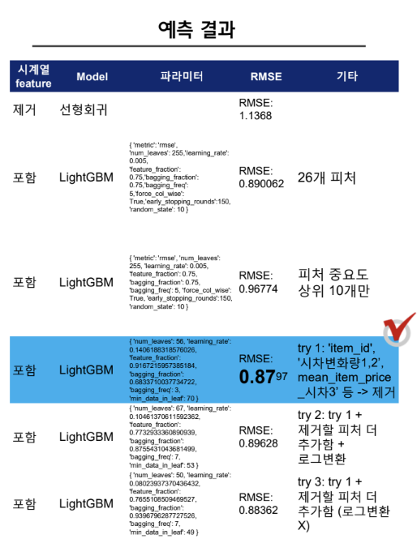

# DATATHON: CO2 사업 월간 보고서


###  **CO2 사업 월간 보고**

### ✅**팀 소개 (Team Introduction)**

- 팀명 **C02**

- 팀원 소개

  김현민(팀장), 박채훈, 전영은, 주원희, 홍일붕


### ✅ 프로젝트 개요 (Project Overview)

CO2 Company의 과거 판매 데이터를 분석하고, 2015년 11월 매출을 예측하여 실적 관리, 상품 개발, 매장 운영 개선을 지원한다.

- 문제 정의
  - CO2 Company 인수 후 데이터 점검 및 월별 실적 분석 방안, 익월 실적 예측 방안 도출의 필요성.
  - 정확한 11월 매출 예측을 통해 효율적인 비즈니스 의사결정을 돕는 것.
- 해결 방안 요약
  - 2013년 1월부터 2015년 10월까지의 판매 데이터를 기반으로 머신러닝 모델을 구축하여 2015년 11월 매출을 예측한다.
  - 예측 결과는 매장 등급별 평균 매출량과 전년 동월 대비 증감률을 포함하여 제공된다.


### ✅ 프로젝트 구조 (Project Structure)

- 폴더 및 파일 구조

  ```
  📦 DATATHON
  ┣ 📂 Code
  ┃ ┣ 📘 Feature Engineering n ML.ipynb
  ┃ ┣ 📘 Feature Engineering n ML v0.ipynb
  ┃ ┣ 📘 Feature Engineering n ML v1.ipynb
  ┃ ┣ 📊 datathon_predict_sales_보고서 작성용 시각화_v0.ipynb
  ┃ ┣ 📊 datathon_predict_sales_보고서 작성용 시각화_v1.ipynb
  ┃ ┣ 🌐 translate_ru_to_en.ipynb
  ┣ 📂 Input
  ┃ ┣ 📄 calendar.csv
  ┃ ┣ 📄 item_categories.csv
  ┃ ┣ 📄 items-translated.csv
  ┃ ┣ 📄 predict_sales_filled_3.xlsx
  ┃ ┣ 📄 sales_train.csv
  ┃ ┣ 📄 sample_submission.csv
  ┃ ┣ 📄 shops_graded.csv
  ┃ ┣ 📄 shops_graded_v2.csv
  ┃ ┣ 📄 test.csv
  ┣ 📂 Output
  ┃ ┣ 🟥 datathon_predict_sales_CO2_보고서_v7.pdf
  ┃ ┣ 🧧 datathon_predict_sales_CO2_보고서_v7.pptx
  ┣ 📂 Images
  ┃ ┣ 🖼️ modeling.png
  ┣ 📄 README.md
  ```


------

### ✅ 데이터 설명 (Dataset Description)

- **데이터 출처**

  Kaggle Predict Future Sales 

  https://www.kaggle.com/competitions/competitive-data-science-predict-future-sales

  

- **주요 컬럼 및 의미 설명**

  - **`ID`** - 테스트 세트 내의 (Shop, Item) 튜플을 나타내는 ID
  - **`shop_id`** - 상점의 고유 식별자
  - **`item_id`** - 제품의 고유 식별자
  - **`item_category_id`** - 품목 카테고리의 고유 식별자
  - **`item_cnt_day`** - 판매된 제품 수. 이 측정값의 월별 양을 예측
  - **`item_price`** - 항목의 현재 가격
  - **`date`** - dd/mm/yyyy 형식의 날짜
  - **`date_block_num`** - 편의상 사용되는 연속된 월 번호 (2013년 1월은 0, 2013년 2월은 1,..., 2015년 10월은 33)
  - **`item_name`** - 항목 이름
  - **`shop_name`** - 상점 이름
  - **`item_category_name`** - 품목 카테고리의 이름

  

  **전처리 내용 요약**

  - **러시아어 -> 영어로 번역** (`shops.csv`, `item_categories.csv`)
  - **결측치 처리**
  - **이상치 제거** `item_price` 및 `item_cnt_day`에서 이상치 제거.
  - **피처 엔지니어링:** 시계열 관련 파생 변수 (Lag..)
  - **데이터 타입 변환:** 모델 학습에 적합하도록 데이터 타입 변환.


------

### ✅ 모델 및 방법론 (Model & Methodology)

optuna 를 사용하여 하이퍼파라미터 튜닝 + feature importance가 낮은 컬럼 5개 제거 후 LightGBM 모델이 0.87로 모델 선택




------

### ✅ 시각화 및 주요 인사이트 (Visualizations & Key Insights)
(https://github.com/wonhee126/DATATHON/blob/ab849a19bc898485cd601a0fe18e2a6eedadea49/Output/datathon_predict_sales_CO2_%EB%B3%B4%EA%B3%A0%EC%84%9C_v7.pdf)
